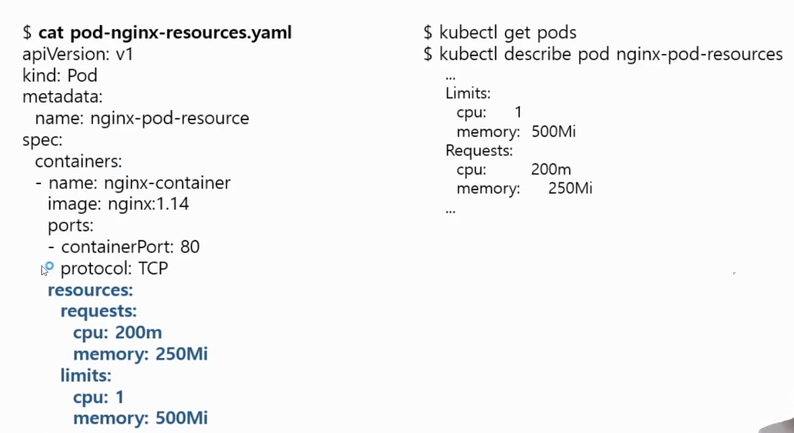

# 쿠버네티스 Pod - Assigning Resources to Pods (CPU/memory requests, limits)

# 6. Pod에 리소스(cpu, memory) 할당하기

- control plane, 각 worker node는 각 Computer로, CPU, Memory를 가지고 있다.
- pod가 node의 CPU, Memory를 얼마나 쓸지 정해줘야 한다.
- control plane의 scheduler가 어떤 node의 CPU, Memory 상태를 파악하고 어디에 할당할지 판단한다.
- 그래서 Pod 생성 시, 최소한의 resources를 정해서 요청하면, scheduler가 여유가 있는 node에 배치해준다.

## Pod Resource 요청 및 제한

- Resource Requests
  - Pod를 실행하기 위한 최소 리소스 양을 요청
- Resource Limits
  - Pod가 사용할 수 있는 최대 리소스 양을 제한
  - Memory limit을 초과해서 사용되는 파드는 종료(OOM Kill)되며 다시 스케줄링 된다.

## Container Resource 설정 예



- Pod의 container 별로 resources를 설정한다.

## Resource 표기법

### Memory

- 1MB = 1024KB 일까?
- 1MB = 1000KB 이고, 1MiB = 1024KiB이다. (표기 시 B는 생략해서 1000Ki와 같이 표기)

### CPU

- CPU는 용량이 아니라, 코어 수 기반으로 표기한다.
- 1 core = 1000m

## Example

```yaml
apiVersion: v1
kind: Pod
metadata:
  name: nginx-pod-resources
spec:
  containers:
    - name: nginx-container
      image: nginx:1.14
      ports:
        - containerPort: 80
          protocol: TCP
      resources:
        requests:
          memory: 500Mi
          cpu: 1
```

- `$ kubectl create -f pod-nginx-resources.yaml`
- `$ kubectl describe pod nginx-pod-resources`
  - 설정한 resources만큼 할당된 것 확인
- 만약 limits만 걸면, requests도 동일한 값으로 들어가게 된다.
- 만약 모든 node가 cpu가 2코어인데, requests에도 2코어를 할당하면, 어떤 node에도 배치되지 않아 pending 상태로 남아있다.
