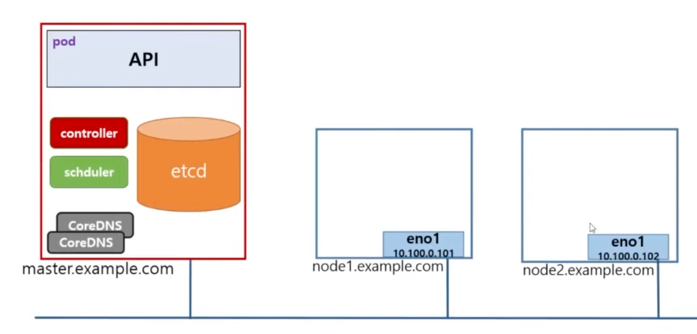
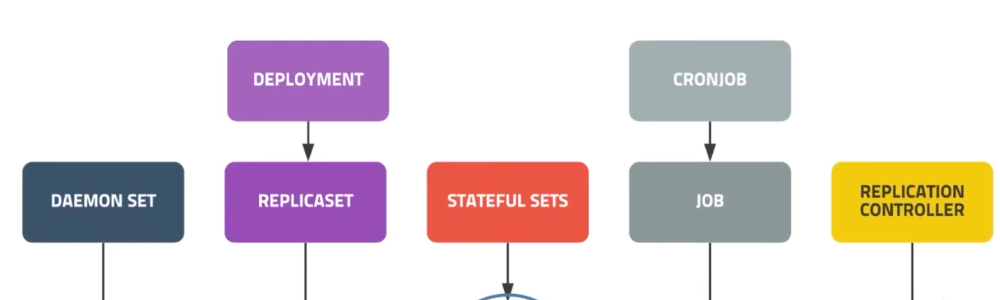
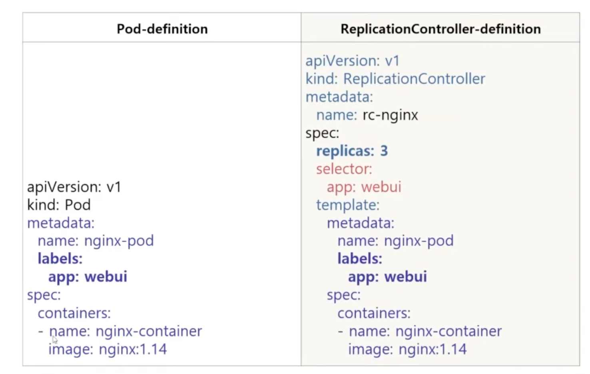

# Controller - ReplicationContoller란?

## 학습내용

- ReplicationController
- ReplicaSet
- Deployment
- DaemonSet
- StatefulSet
- Job
- CronJob

## Controller란

- Pod의 개수를 보장
  

- `kubectl` 명령어로 nginx 웹서버 3개 실행해줘 -> API가 etcd에서 정보를 얻어옴 -> 스케줄러에게 요청 -> node1, node2 중에 어디에 3개를 배치할지 결정 -> controller에게 nginx 컨테이너 3개를 보장해라 -> API는 선택해준 node에 컨테이너를 배치 -> 3개의 nginx 컨테이너가 실행되고 있는지 모니터링 -> 3개가 아니면 API에 생성하라고 요청 -> 다시 스케줄러를 통해 결정된 node에 컨테이너 생성
  

## ReplicationController

- 요구하는 Pod의 개수를 보장하며 파드 집합의 실행을 항상 안정적으로 유지하는 것을 목표
  - 요구하는 Pod의 개수가 부족하면 template을 이용해 Pod를 추가
  - 요구하는 Pod의 개수보다 많으면 최근에 생성된 Pod를 삭제
- 기본 구성
  - selector
  - replicas
  - template

  ```yaml
  apiVersion: v1
  kind: ReplicationController
  metadata:
    name: <RC_이름>
  spec:
    replicas: <배포갯수>
    selector:
      key: value # 해당하는 Pod가 있으면
    template: <컨테이너 템플릿>
  ```

  

- `$ cat rc-nginx.yaml`

  ```yaml
  apiVersion: v1
  kind: ReplicationController
  metadata:
    name: rc-nginx
  spec:
    replicas: 3
    selector:
      app: webui
    template:
      metadata:
        name: nginx-pod
        labels:
          app: webui
      spec:
        containers:
          - name: nginx-container
            image: nginx:1.14
  ```

- spec의 container 정보를 변경(ex. nginx:1.14 -> nginx:1.15)해도 Pod의 상태는 변함없음
- labels 정보만 참고하기 때문에, 만약 Pod를 직접 삭제하거나 하는 경우에는 새로운 버전(1.15)으로 생성됨
